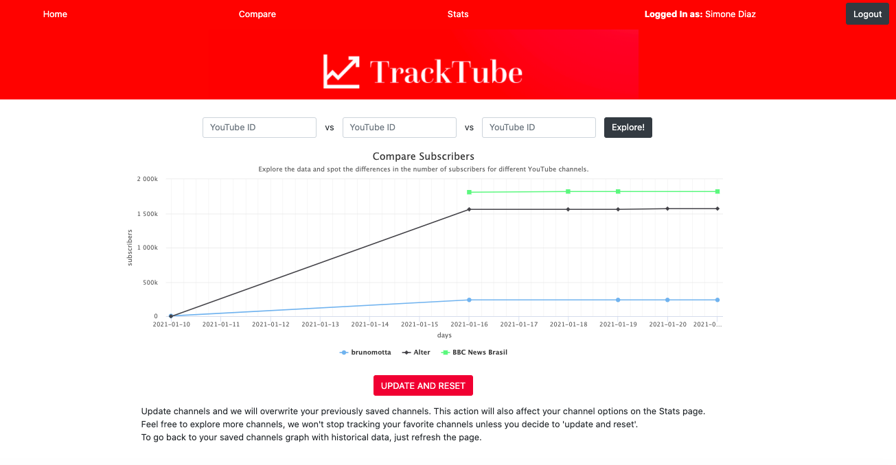

# TrackTube

TrackTube is and analycis tool for YouTube stats. 

Professional and amateur youtubers can use TrackTube to monitor and compare their channel growth/performance with their closest competitors, they can also build historical data about their favourite channel and make better informed decisions towards optimal growth. 

[VISIT TRACKTUBE](https://tracktube.netlify.app/)

## Stack

### FrontEnd
- Javascript
- ReactJS
- Redux
- Bootstrap 
- CSS and SCSS

### Backend
- Node.js
- Express.js
- PostgresSQL
- Sequelize ORM

## Core Concepts and Goals

The main goal of this project was to have a functional MVP from ideation to deployment in 2 weeks. The process included:
- designing wireframes
- designing database models
- creating user stories
- coding backend and frontend of the app 
- deploying a full functional MVP

Some of the concepts used:
- implementing database model
- injesting third-party API
- using external library for chart (Highcharts)
- using git and branches 

## Features and Pages
### Home
- Contains a marketing/explainer video, so users can learn about the tool before sign up.
- Contains a green CTA: Sign Up for free.
- In the header, users can see which pages are present in the app and log in.

### Explore
This page has two main functionalities 
- It allows users to explore on the graph the count of subscribers (today) for 3 YouTube channels. 
- It allows users to save channels (persist channel + stats info in the project's DB) and start building records of susbcribers count per day. This means that every time the user logs in, TrackTube backend runs checks and get data from YouTube API if necessary.

### Stats
- The stats page consults previously saved favorites in the database and retrieve the latest stats for them.
- It displayes basic global stats as well as average calculations.

## General Project Info
- Project Wireframe [here](https://wireframepro.mockflow.com/view/M2c5b4431476c092b16a9c8025f6ba3e21610116565680)
- Database Model Diagram [here](https://dbdiagram.io/d/5ffb526280d742080a35b822)
- Project Board (user stories) [here](https://github.com/users/fabianaColombo/projects/2?add_cards_query=is%3Aopen)

## Backend repo

The server of this project can be found [here](https://github.com/fabianaColombo/tracktube-server)
